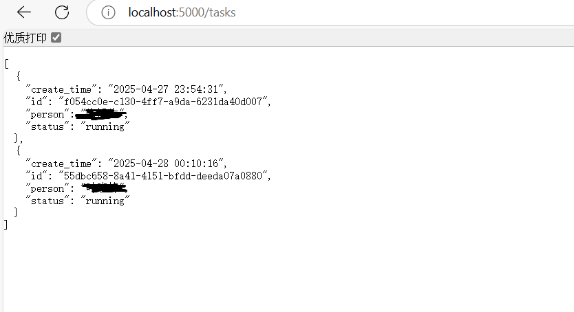
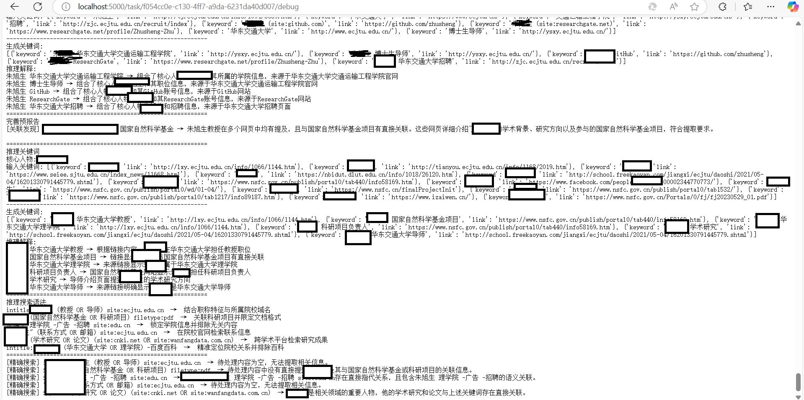
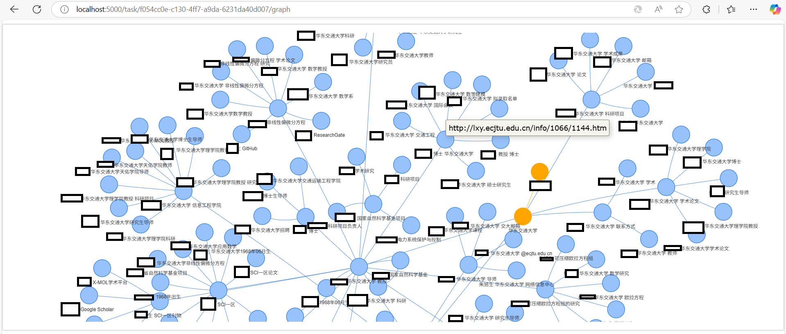
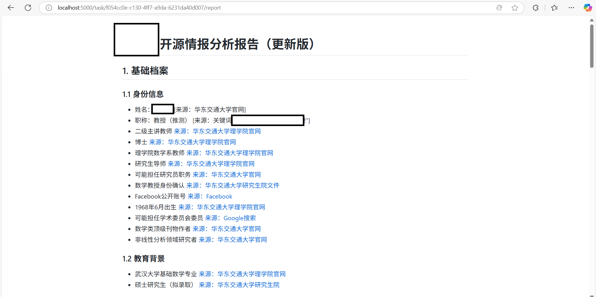

# OSINT Persona Analyzer

[](https://opensource.org/licenses/MIT)
[](https://www.python.org/)

自动化开源情报分析系统，通过多源数据采集和AI推理生成结构化人物档案与交互式知识图谱。


## 核心功能

### 🕵️ 智能情报采集
- DuckDuckGo/Bing多引擎搜索
- 自适应关键词扩展
- 数据关联性验证（双重校验机制）

### 🧠 AI信息处理
- GPT模型驱动数据解析
- 结构化提示工程模板
- 多维度信息推理（社交关系/职业轨迹/数字足迹）

### 📊 知识图谱构建
- 动态节点管理（自动去重）
- 交互式关系图谱
- 点击复制节点信息（支持URL溯源）

### 📄 报告生成系统
- Markdown结构化输出
- 多阶段报告迭代机制
- HTML可视化转换

## 快速开始

### 环境要求
```bash
Python 3.8+ 
```

### 安装步骤
```bash
安装依赖
pip install -r requirements.txt

配置文件设置
config/config.yaml
编辑config.yaml填入API密钥和模型参数
```

### 启动服务
```bash
python main.py
```

## API接口说明

### 启动分析任务
```bash
GET /add_task?person=<姓名>&keyword=<关键词1>
```

**响应示例**:
```json
{
    "task_id": "550e8400-e29b-41d4-a716-446655440000",
    "monitor_url": "/task/550e8400...",
    "graph_url": "/task/550e8400.../graph",
    "report_url": "/task/550e8400.../report"
}
```

### 获取分析结果
| 端点 | 格式 | 功能 |
|------|------|------|
| `/task/<id>` | JSON | 任务状态查询 |
| `/task/<id>/report` | HTML | 分析报告查看 |
| `/task/<id>/report?download` | Markdown | 分析报告下载 |
| `/task/<id>/graph` | Interactive HTML | 关系网可视化 |
| `/task/<id>/graph?download` | HTML | 关系网下载 |
| `/task/<id>/debug` | txt | 查看任务日志 |


## 配置示例

```
base_models:
  - model: "Qwen/Qwen2.5-72B-Instruct-128K"
    api_key: "sk-wu****yfkmi"
    base_url: "https://api.siliconflow.cn/v1"

  - model: "deepseek-v3-0324"
    api_key: "sk-wu****yfkmi"
    base_url: "https://api.damodel.com/v1"
    
  - model: "THUDM/GLM-Z1-9B-0414"
    api_key: "sk-wu****yfkmi"
    base_url: "https://api.siliconflow.cn/v1"
    
reasoning_models:
  - model: "deepseek-v3-0324"
    api_key: "sk-wu****yfkmi"
    base_url: "https://api.damodel.com/v1"
```


# 示例

## 任务状态




## 日志情况




## 关系网



点击节点自动复制


## 报告生成



